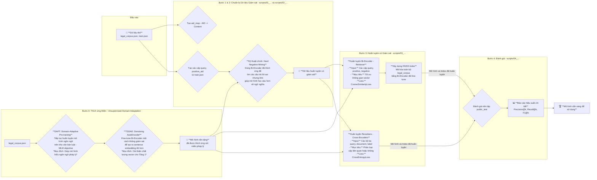

# Hệ thống Hỏi-đáp Pháp luật (Legal QA)

[](https://opensource.org/licenses/MIT)

Dự án này xây dựng một hệ thống Hỏi-đáp (Question Answering) cho lĩnh vực pháp luật Việt Nam, sử dụng các mô hình ngôn ngữ lớn (Large Language Models) và kiến trúc tìm kiếm-xếp hạng (retrieval-reranking) 3 tầng tiên tiến.

---

## Mục lục

- [Kiến trúc hệ thống](#kiến-trúc-hệ-thống)
- [Cấu trúc thư mục](#cấu-trúc-thư-mục)
- [Cài đặt](#cài-đặt)
- [Quy trình thực thi](#quy-trình-thực-thi)
  - [Chế độ thực thi: Fast vs Quality](#chế-độ-thực-thi-fast-vs-quality)
  - [Bước 1: Chuẩn bị môi trường & Dữ liệu](#bước-1-chuẩn-bị-môi-trường--dữ-liệu)
  - [Bước 2: Huấn luyện Pipeline](#bước-2-huấn-luyện-pipeline)
  - [Bước 3: Đánh giá Pipeline](#bước-3-đánh-giá-pipeline)
  - [Chạy toàn bộ Pipeline](#chạy-toàn-bộ-pipeline)
- [Chạy giao diện Demo](#chạy-giao-diện-demo)
- [Luồng xử lý & Kỹ thuật chi tiết](#luồng-xử-lý--kỹ-thuật-chi-tiết)
  - [Luồng xử lý câu hỏi (Inference Flow)](#1-luồng-xử-lý-câu-hỏi-inference-flow)
  - [Luồng dữ liệu & huấn luyện (Data & Training Flow)](#2-luồng-dữ-liệu--huấn-luyện-data--training-flow)
  - [Giải thích Kỹ thuật Chi tiết](#3-giải-thích-kỹ-thuật-chi-tiết)
  - [Kỹ thuật Tối ưu Hóa Nâng cao (Unsupervised Domain Adaptation)](#4-kỹ-thuật-tối-ưu-hóa-nâng-cao-unsupervised-domain-adaptation)
- [Dọn dẹp](#dọn-dẹp)

---

## Kiến trúc hệ thống

Hệ thống được xây dựng theo kiến trúc 3 tầng để tối ưu giữa tốc độ và độ chính xác:

1.  **Tầng 1 - Bi-Encoder Retrieval (Tìm kiếm ứng viên):**
    *   **Mô hình:** `bkai-foundation-models/vietnamese-bi-encoder`
    *   **Công nghệ:** Sử dụng FAISS để tạo index vector hóa, giúp tìm kiếm nhanh hàng triệu văn bản pháp luật để tìm ra các ứng viên tiềm năng nhất.

2.  **Tầng 2 - Light Reranker (Lọc nhanh):**
    *   **Mô hình:** Một Cross-Encoder hạng nhẹ.
    *   **Mục đích:** Nhanh chóng lọc và xếp hạng lại các ứng viên từ Tầng 1, loại bỏ các kết quả nhiễu và chỉ giữ lại những kết quả chất lượng cao cho tầng cuối.

3.  **Tầng 3 - Cross-Encoder Reranking (Xếp hạng chính xác):**
    *   **Mô hình:** `vinai/phobert-base-v2` (hoặc các mô hình lớn hơn).
    *   **Mục đích:** Sử dụng một mô hình Cross-Encoder mạnh mẽ để phân tích sâu mối quan hệ giữa câu hỏi và từng văn bản luật, đưa ra xếp hạng cuối cùng với độ chính xác cao nhất.

## Cấu trúc thư mục

```
nlp-drill-chatbot/
├── app/                  # Mã nguồn giao diện Streamlit
├── core/                 # Các thành phần cốt lõi (pipeline, retrieval, reranking)
│   ├── services/         # Các dịch vụ (logging, evaluation)
├── scripts/              # Các script để chạy từng bước của pipeline
├── data/                 # (Cần tự tạo) Chứa dữ liệu thô và đã xử lý
├── models/               # (Tự động tạo) Chứa các mô hình đã huấn luyện
├── indexes/              # (Tự động tạo) Chứa FAISS index
├── reports/              # (Tự động tạo) Chứa báo cáo đánh giá
├── logs/                 # (Tự động tạo) Chứa file log
├── run_pipeline.py       # Script chính để điều phối toàn bộ pipeline
├── requirements.txt      # Các thư viện cần thiết
└── README.md             # File hướng dẫn
```

## Cài đặt

1.  **Clone repository:**
    ```bash
    git clone https://your-repository-url.git
    cd nlp-drill-chatbot
    ```

2.  **Tạo môi trường ảo (khuyến khích):**
    ```bash
    python -m venv venv
    source venv/bin/activate  # Trên Windows: venv\Scripts\activate
    ```

3.  **Cài đặt các thư viện cần thiết:**
    ```bash
    pip install -r requirements.txt
    ```

## Quy trình thực thi

Bạn có thể chạy từng bước riêng lẻ hoặc chạy toàn bộ pipeline bằng một câu lệnh duy nhất.

### Chế độ thực thi: Fast vs Quality

Hệ thống hỗ trợ 2 chế độ để tối ưu cho các mục đích khác nhau, được điều khiển bằng cờ `--mode`:

-   **`--mode fast` (Mặc định khi phát triển):**
    -   **Khi nào dùng:** Khi phát triển, gỡ lỗi hoặc chạy thử nghiệm nhanh.
    -   **Đặc điểm:** Sử dụng ít dữ liệu hơn, số epochs ít, batch size nhỏ. Huấn luyện nhanh nhưng độ chính xác không phải là tốt nhất.

-   **`--mode quality` (Mặc định khi chạy production):**
    -   **Khi nào dùng:** Khi huấn luyện mô hình cuối cùng để triển khai hoặc để có kết quả đánh giá chính xác nhất.
    -   **Đặc điểm:** Sử dụng toàn bộ dữ liệu, số epochs nhiều hơn, cấu hình tối ưu cho chất lượng. Thời gian huấn luyện sẽ lâu hơn đáng kể.

### Bước 1: Chuẩn bị môi trường & Dữ liệu

Trước tiên, hãy đảm bảo bạn đã tải và đặt các file dữ liệu vào thư mục `data/raw/`:
- `legal_corpus.json`
- `train.json`
- `public_test.json`

Chạy script sau để chuẩn bị môi trường và xử lý dữ liệu.

```bash
python scripts/01_prepare_environment.py --mode fast
python scripts/02_prepare_data.py --mode fast
```
*Lưu ý: Thay `--mode fast` bằng `--mode quality` nếu bạn muốn xử lý dữ liệu cho chế độ chất lượng cao.*

### Bước 2: Huấn luyện Pipeline

Script này sẽ huấn luyện các mô hình Bi-Encoder, Cross-Encoder và xây dựng FAISS index.

```bash
python scripts/03_train_pipeline.py --mode fast
```

### Bước 3: Đánh giá Pipeline

Sau khi huấn luyện, chạy script này để đánh giá hiệu suất của hệ thống trên tập dữ liệu kiểm thử.

```bash
python scripts/04_evaluate_pipeline.py --mode fast
```
Báo cáo chi tiết sẽ được lưu trong thư mục `reports/`.

### Chạy toàn bộ Pipeline

Để đơn giản hóa, bạn có thể sử dụng script `run_pipeline.py` để thực thi tất cả các bước trên một cách tuần tự. Script này cũng hỗ trợ tiếp tục chạy từ bước bị lỗi (`--resume`).

#### Chạy Pipeline

```bash
# Chạy toàn bộ pipeline ở chế độ FAST
python run_pipeline.py --mode fast

# Chạy toàn bộ pipeline ở chế độ QUALITY (sẽ mất nhiều thời gian)
python run_pipeline.py --mode quality
```

#### Tùy chọn Nâng cao

```bash
# Hiển thị các bước có trong pipeline
python run_pipeline.py --show-steps

# Chạy lại pipeline và xóa checkpoint cũ (bắt đầu lại từ đầu)
python run_pipeline.py --mode fast --no-resume
```

#### Tối ưu hóa các lần chạy sau với `--no-dapt`

-   **Mặc định:** Quy trình thích ứng miền (DAPT & TSDAE) được **bật sẵn** khi bạn chạy `run_pipeline.py`. Đây là bước quan trọng nhưng tốn nhiều thời gian.
-   **Khi nào cần:** Bạn chỉ cần chạy bước này **một lần duy nhất** cho mỗi bộ dữ liệu `legal_corpus`. Sau khi các mô hình `dapt_base_model` và `tsdae_adapted_model` đã được tạo trong thư mục `models/`, bạn không cần chạy lại nó.
-   **Cách tối ưu:** Để tiết kiệm thời gian đáng kể cho các lần chạy sau, hãy **tắt** bước này đi bằng cờ `--no-dapt`.

**Ví dụ quy trình làm việc hiệu quả:**

```bash
# Lần chạy ĐẦU TIÊN (bật DAPT để tạo mô hình nền tảng)
# Cờ --include-dapt là mặc định nên không cần thêm vào
python run_pipeline.py --mode quality

# TẤT CẢ các lần chạy SAU (tắt DAPT để tiết kiệm thời gian)
python run_pipeline.py --mode quality --no-dapt
```

## Chạy giao diện Demo

Sau khi đã huấn luyện xong các mô hình, bạn có thể khởi động giao diện web để tương tác trực tiếp với hệ thống.

```bash
streamlit run app/app.py
```
Mở trình duyệt và truy cập vào địa chỉ được cung cấp (thường là `http://localhost:8501`).

## Dọn dẹp

Để dọn dẹp các mô hình và checkpoint cũ nhằm giải phóng dung lượng đĩa, bạn có thể chạy:

```bash
# Chạy thử để xem file nào sẽ bị xóa (chưa xóa thật)
python scripts/05_cleanup_old_models.py --dry-run

# Chạy thật để xóa file
python scripts/05_cleanup_old_models.py
```

---

## Luồng xử lý & Kỹ thuật chi tiết

Để hiểu sâu hơn về cách hệ thống hoạt động, dưới đây là hai sơ đồ chi tiết mô tả luồng xử lý câu hỏi và luồng huấn luyện mô hình.

### 1. Luồng xử lý câu hỏi (Inference Flow)

Sơ đồ này giải thích hành trình của một câu hỏi từ khi người dùng nhập vào cho đến khi nhận được câu trả lời cuối cùng, làm rõ vai trò kỹ thuật của từng tầng.

```mermaid
graph TD
    subgraph Đầu vào
        A[👨‍💻 Người dùng nhập câu hỏi]
    end

    A --> B{**core.pipeline.LegalQAPipeline**}

    B --> T1[**Tầng 1: Retrieval - Bi-Encoder**<br/>Mục tiêu: Tốc độ & Không bỏ sót - High Recall]
    subgraph Chi tiết Tầng 1
        T1 --> T1_1[1/ Mã hóa câu hỏi thành Query Vector<br/>Model: vietnamese-bi-encoder]
        T1_1 --> T1_2[2/ Tìm kiếm K vector văn bản gần nhất<br/>trong kho FAISS Index bằng phép tính<br/>Inner Product - tương đương Cosine Similarity]
        T1_2 --> T1_3[📄 **Output**: Top 200 ứng viên tiềm năng]
    end

    T1_3 --> T2[**Tầng 2: Light Reranker**<br/>Mục tiêu: Lọc nhanh & Hiệu quả]
    subgraph Chi tiết Tầng 2
        T2 --> T2_1[1/ Input: Query & 200 ứng viên]
        T2_1 --> T2_2[2/ Chấm điểm từng cặp CLS - Classification token query SEP - Separator token document SEP<br/>bằng Cross-Encoder hạng nhẹ]
        T2_2 --> T2_3[📄 **Output**: Top 80 ứng viên chất lượng cao]
    end

    T2_3 --> T3[**Tầng 3: Strong Reranker**<br/>Mục tiêu: Độ chính xác cao nhất - High Precision]
    subgraph Chi tiết Tầng 3
        T3 --> T3_1[1/ Input: Query & 80 ứng viên]
        T3_1 --> T3_2[2/ Phân tích sâu từng cặp bằng<br/>Cross-Encoder hạng nặng - PhoBERT-Law]
        T3_2 --> T3_3[📄 **Output**: Top 5-10 kết quả cuối cùng với điểm số chính xác]
    end

    T3_3 --> F[✅ Hiển thị kết quả cho người dùng]
```



### 2. Luồng dữ liệu & huấn luyện (Data & Training Flow)

Sơ đồ này mô tả quy trình "nhà máy" sản xuất ra các mô hình AI, từ dữ liệu thô ban đầu, qua các bước xử lý kỹ thuật như "Hard Negative Mining", đến huấn luyện và đánh giá.



### 3. Giải thích Kỹ thuật Chi tiết

Phần này sẽ đi sâu vào các khái niệm kỹ thuật cốt lõi được đề cập trong sơ đồ.

#### **Bi-Encoder vs. Cross-Encoder: Sự khác biệt cốt lõi**

| Đặc điểm | **Bi-Encoder (Retriever - Tầng 1)** | **Cross-Encoder (Reranker - Tầng 2 & 3)** |
| :--- | :--- | :--- |
| **Kiến trúc** | Xử lý `query` và `document` **riêng biệt**, tạo ra 2 vector độc lập. | Xử lý `query` và `document` **cùng lúc** trong một chuỗi duy nhất: `[CLS] query [SEP] document [SEP]`. |
| **Tốc độ** | **Rất nhanh.** Vector của toàn bộ kho pháp luật có thể được tính toán trước và lưu vào FAISS. Khi có câu hỏi mới, chỉ cần mã hóa câu hỏi và tìm kiếm. | **Chậm.** Phải tính toán lại từ đầu cho mỗi cặp (query, document). Không thể tính toán trước. |
| **Độ chính xác** | **Thấp hơn.** Chỉ so sánh sự tương đồng tổng thể giữa 2 vector. | **Cao hơn.** Mô hình có thể học được sự tương tác sâu sắc giữa các từ trong query và document nhờ cơ chế self-attention. |
| **Mục đích** | **Tìm kiếm (Retrieval):** Lọc ra một tập hợp lớn các ứng viên tiềm năng từ hàng triệu tài liệu. Tối ưu cho Recall. | **Xếp hạng lại (Reranking):** Sắp xếp lại một tập hợp nhỏ các ứng viên để tìm ra câu trả lời chính xác nhất. Tối ưu cho Precision. |

> Kiến trúc 3 tầng của project này kết hợp ưu điểm của cả hai: **tốc độ của Bi-Encoder** và **độ chính xác của Cross-Encoder**.

#### **Tại sao Hard Negative Mining lại quan trọng?**

- **Negative thông thường (Random Negative):** Là một văn bản được chọn ngẫu nhiên. Thường thì mô hình sẽ dễ dàng nhận ra nó không liên quan đến câu hỏi. (Ví dụ: câu hỏi về luật lao động, negative là luật đất đai).
- **Hard Negative:** Là một văn bản sai, nhưng lại "trông có vẻ" đúng. Nó có thể chứa nhiều từ khóa giống với câu hỏi nhưng ngữ nghĩa lại khác.
- **Lợi ích:** Bằng cách huấn luyện với Hard Negatives, chúng ta buộc mô hình phải học sâu hơn về ngữ nghĩa thay vì chỉ dựa vào từ khóa bề mặt. Điều này giúp mô hình phân biệt được những khác biệt tinh vi và cải thiện đáng kể độ chính xác.

#### **FAISS và `IndexFlatIP`**

- **FAISS (Facebook AI Similarity Search):** Là một thư viện được tối ưu hóa cho việc tìm kiếm tương đồng trên các tập vector cực lớn.
- **`IndexFlatIP`:** Là một loại index trong FAISS.
    - **`Flat`:** Có nghĩa là nó sẽ so sánh "brute-force" vector câu hỏi với tất cả các vector trong kho. Mặc dù gọi là brute-force, nó vẫn cực kỳ nhanh nhờ các tối ưu hóa của FAISS.
    - **`IP` (Inner Product):** Phép tính tích vô hướng. Khi các vector đã được **chuẩn hóa L2** (độ dài vector bằng 1), thì **tích vô hướng chính là giá trị của Cosine Similarity**. Đây là một kỹ thuật tối ưu hóa phổ biến để tìm kiếm theo độ tương đồng cosine.

#### **Lựa chọn Loss Function**

- **`CosineSimilarityLoss` (cho Bi-Encoder):** Mục tiêu của hàm loss này là tối ưu hóa Cosine Similarity giữa các cặp vector. Nó sẽ cố gắng đưa giá trị similarity của các cặp *positive* (query, câu trả lời đúng) tiến về 1, và của các cặp *negative* tiến về -1 (hoặc 0). Điều này phù hợp với việc sắp xếp các văn bản trong không gian vector.
- **`CrossEntropyLoss` (cho Cross-Encoder):** Cross-Encoder hoạt động như một mô hình phân loại (classification). Nó phân loại cặp (query, document) là "liên quan" (label 1) hay "không liên quan" (label 0). `CrossEntropyLoss` là hàm loss tiêu chuẩn và hiệu quả nhất cho các bài toán phân loại như vậy.

### 4. Kỹ thuật Tối ưu Hóa Nâng cao (Unsupervised Domain Adaptation)

Trước khi đi vào huấn luyện có giám sát (supervised training) với các cặp câu hỏi-trả lời, project này sử dụng hai kỹ thuật **huấn luyện không giám sát (unsupervised)** tiên tiến để giúp mô hình ngôn ngữ "thích ứng" với miền kiến thức pháp luật. Đây là một bước tiền xử lý quan trọng giúp cải thiện đáng kể hiệu suất cuối cùng.

#### **DAPT (Domain-Adaptive Pre-training)**

*   **Là gì?** DAPT là quá trình "huấn luyện tiếp" (continue pre-training) một mô hình ngôn ngữ đã được huấn luyện trước (như `PhoBERT`) trên một kho văn bản lớn và chuyên biệt (ở đây là toàn bộ `legal_corpus.json`).
*   **Tại sao cần?** Các mô hình ngôn ngữ không được dạy về từ vựng, thuật ngữ và cấu trúc câu phức tạp của văn bản pháp luật. DAPT giúp mô hình "học ngôn ngữ pháp lý", làm quen với các khái niệm và ngữ cảnh đặc thù trước khi thực hiện nhiệm vụ chính. Quá trình này thường sử dụng mục tiêu huấn luyện là Masked Language Modeling (MLM), tương tự như khi huấn luyện BERT từ đầu.
*   **Kết quả:** Một mô hình ngôn ngữ nền tảng có khả năng hiểu sâu hơn về miền pháp luật.

#### **TSDAE (Transformer-based Denoising AutoEncoder)**

*   **Là gì?** TSDAE là một phương pháp không giám sát để fine-tune các mô hình tạo **sentence embedding** (như Bi-Encoder).
*   **Hoạt động như thế nào?**
    1.  Lấy một câu trong kho văn bản pháp luật.
    2.  Tạo ra một phiên bản "nhiễu" (noisy) của câu đó bằng cách xóa hoặc tráo đổi một vài từ.
    3.  Yêu cầu mô hình (Encoder) đọc câu bị nhiễu và tạo ra một vector embedding.
    4.  Sau đó, một bộ giải mã (Decoder) sẽ cố gắng **tái tạo lại vector embedding của câu gốc (không nhiễu)** từ vector của câu nhiễu.
*   **Tại sao cần?** Quá trình này buộc mô hình phải học cách nắm bắt ý nghĩa cốt lõi của câu, bỏ qua các chi tiết nhiễu. Nó giúp Bi-Encoder tạo ra các vector câu (sentence embeddings) mạnh mẽ, ổn định và giàu ngữ nghĩa hơn, điều này cực kỳ quan trọng cho chất lượng của Tầng 1 (Retrieval).

> **Tóm lại:** DAPT và TSDAE là các bước "khởi động" không giám sát, giúp tạo ra một mô hình nền tảng **đã được chuyên môn hóa cho lĩnh vực pháp luật**. Mô hình nền tảng này sau đó sẽ được sử dụng cho cả việc khai thác Hard Negatives và cho quá trình huấn luyện có giám sát cuối cùng, mang lại hiệu quả vượt trội.